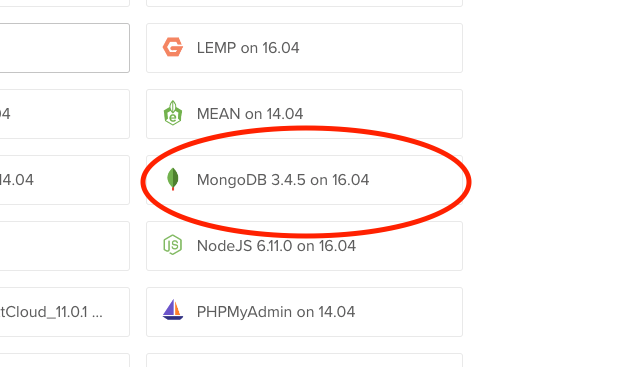

# Betabox Seed App

## Deployment

### Digital Ocean MongoDB Setup

1. Choose the 3.4.5 on 16.04 image.



2. Name the database instance ${PROJECT-NAME}-db.

3. Add the mongo IP via the scaffolding scripts (usually something like mongodb://XXX.YYY.ZZ.AAA:27017/beta-box).

4. Modify /etc/mongod.conf to use the ip of the instance, instead of a local IP:

```bash
# network interfaces
net:
  port: 27017
  bindIp: 127.0.0.1
```

Becomes

```bash
# network interfaces
net:
  port: 27017
  bindIp: XXX.YYY.ZZ.AAA
```

5. You will then need to restart the mongod service.

```bash
sudo service mongod restart
```

6. Finally, setup the firewall on the instance so it only allows connections from the droplets containing the application.

```bash
sudo apt-get install ufw
sudo ufw default deny incoming
sudo ufw default allow outgoing
sudo ufw allow ssh
sudo ufw allow from ip.address.to.allow
sudo ufw enable
```

#### Additional Reading

* [MongoDB One-Click Applications](https://www.digitalocean.com/community/tutorials/how-to-use-the-mongodb-one-click-application)
* [Share MongoDB Between Two Droplets](https://www.digitalocean.com/community/questions/share-mongodb-in-two-droplets)
